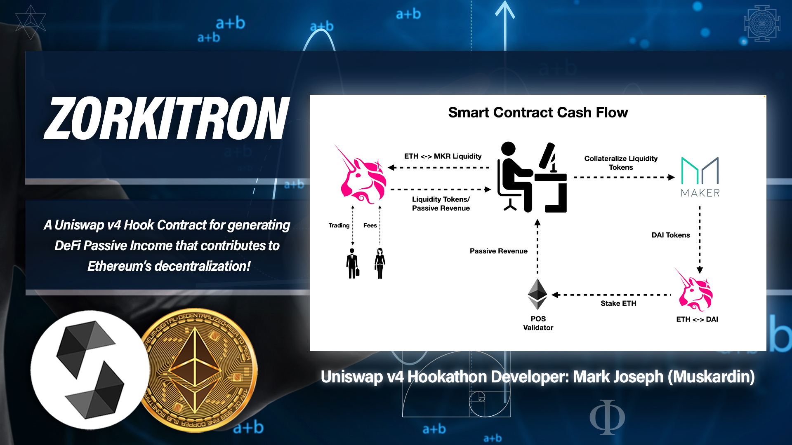
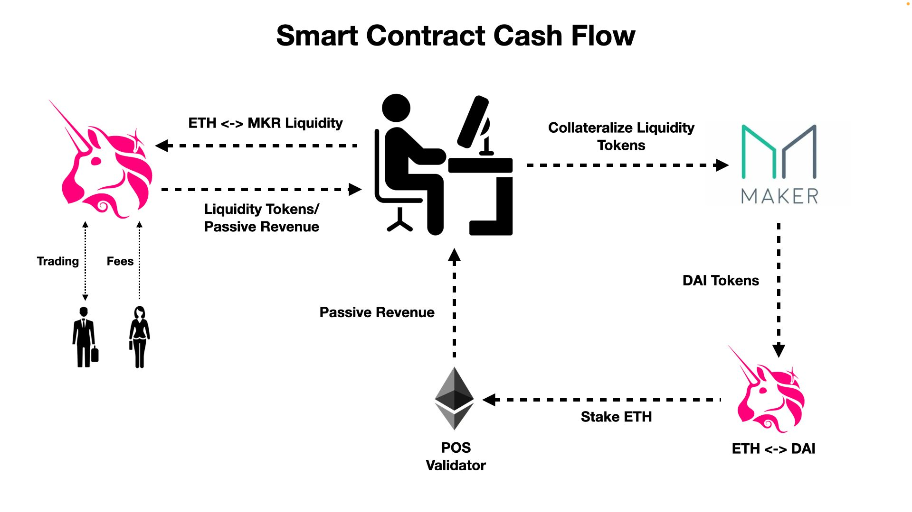

# Zorkitron

A Uniswap v4 Hook Contract for generating DeFi Passive Income yield that contributes to the decentralization of Ethereum! 


## Foundry

**Foundry is a blazing fast, portable and modular toolkit for Ethereum application development written in Rust.**

Foundry consists of:

-   **Forge**: Ethereum testing framework (like Truffle, Hardhat and DappTools).
-   **Cast**: Swiss army knife for interacting with EVM smart contracts, sending transactions and getting chain data.
-   **Anvil**: Local Ethereum node, akin to Ganache, Hardhat Network.
-   **Chisel**: Fast, utilitarian, and verbose solidity REPL.

## Concept




## Documentation

https:book.getfoundry.sh/

## Usage

### Build

```shell
$ forge build
```

### Test

```shell
$ forge test
```

### Format

```shell
$ forge fmt
```

### Gas Snapshots

```shell
$ forge snapshot
```

### Anvil

```shell
$ anvil
```

### Deploy

```shell
$ forge script script/Counter.s.sol:CounterScript --rpc-url <your_rpc_url> --private-key <your_private_key>
```

### Cast

```shell
$ cast <subcommand>
```

### Help

```shell
$ forge --help
$ anvil --help
$ cast --help
```


### Notes

 deposit liquidity into Uniswap
 take liquidity tokens and deposit as collateral into MakerDAO for DAI
 go back to Uniswap and swap DAI for ETH
 take ETH and state into a validator (do you need 32 ETH?)
 this process should be tokenized

 now when you go to withdraw your token...it should get you back the rewards
 rewards in the form of what?

 step 1 - uint liquidity = IUniswapV3Router03(routerAddr).addLiquidity();
 step 2 - uint daiTokens = IMakerDAO(makerDAOAddr).depositCollateral(liquidity);
 step 3 - uint ethTokens = IUniswapV3Router03(routerAddr).swap(daiTokens);

 Staking URLS:
 https:www.staking.directory/
 https:docs.rocketpool.net/guides/staking/overview
 https:help.lido.fi/en/collections/2947324-staking-with-lido
 https:solidity-by-example.org/defi/staking-rewards/


Uniswap v4 Hook Template:
https:github.com/uniswapfoundation/v4-template

 Uniswap v4 Hookathon prizes:
 https:hookathon.atrium.academy/Prizes-9b66d8c94b3b44d9a9cf51349c3f32af

 Uniswap v4 HookMiner:
 https:github.com/Uniswap/v4-periphery/blob/main/src%2Futils%2FHookMiner.sol

 Common Uniswap v4 Hook commands:
 Reference link: https:docs.uniswap.org/contracts/v4/quickstart/hooks/setup
 forge build

# Deploy a Uniswap v4 Hook to a Real Network

https://uniswap.atrium.academy/courses/uniswap-hook-incubator/deploying-a-hook-to-a-real-network/